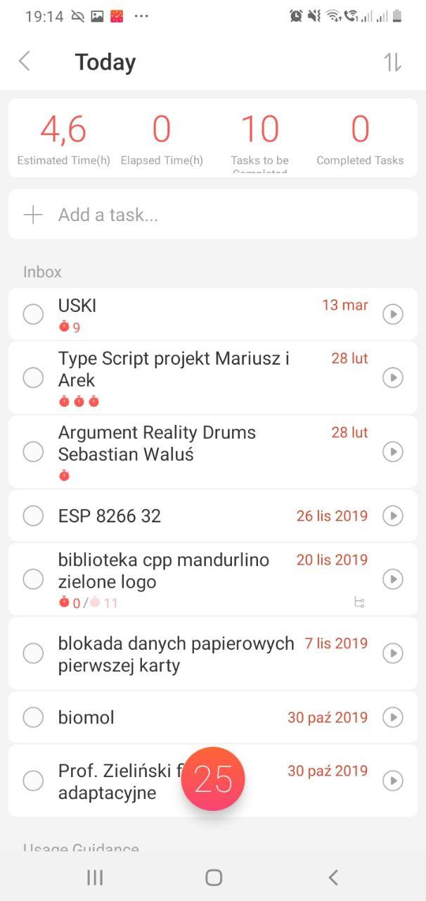

# Dzień dobry
Obecnie najważniejszem wyborem programu jest przeglądarka internetowa, spędzamy w "internecie najwięcej czasu". Dlatego parafrazując klasyka *powiedz mi jakiej przeglądarki używasz, to powiem Ci kim jesteś* 😉
> Czas spędzany przy stanowisku monitorowym:
> 1. Przeglądarka
> 2. Edytor
> 3. Komunikator

## Lista programów
| Kategoria                      | Nazwa   | Link                                                       | Platforma         |
|--------------------------------|---------|------------------------------------------------------------|-----------------------|
| Przeglądarka                   | [Opera](#opera)   | https://www.opera.com/pl/download                | Windows, Linux, macOS |
| Edytor                         | VS Code           | https://code.visualstudio.com                    | Windows, Linux, macOS |
| Klient poczty                  | Thunderbird       | https://www.thunderbird.net                      | Windows, Linux, macOS |
| Przechwytywanie ekranu i publikacja | [ShareX](#ShareX) | https://getsharex.com/downloads                  | Windows               |

Subiektywana lista
----------------
- Multicommander
- Github Desktop
- ConEmu
- [Tomighty](https://tomighty.github.io)

Zarządzanie czasem
===============
##### Dwie drogi tworzenia Checklist (zapisywanie postępu po prawej lub lewej stronie zadania)
| Jakość                       | Ilość    | 
|-------------------------|--|
|- [x] Jakość <br> - [x] Zakończone zadanie <br> - [ ] Następne zadanie | Czas :tomato::tomato::tomato::tomato:<br>Inny projekt :tomato::tomato:<br>(każdy pomidor jest punktem estymacji)|
|**Z życia wzięte**||
| Space | Tomighty|
||

Najczęstszy błąd: założenie że nie potrzebujemy odpoczynku, zmęczenie materiału

Sprawdź jak tworzyć instrukcje takie jak ta [Markdown Cheatsheet](https://github.com/adam-p/markdown-here/wiki/Markdown-Cheatsheet)

## Screenshots

### Opera

>######  Gesty myszy (z prawym przyciskiem myszy) 
>
> 
> [Firefox](https://addons.mozilla.org/pl/firefox/addon/opera-gestures)
> [Chrome](https://www.google.com/search?safe=active&client=opera&hs=sI7&sxsrf=ALeKk01YUHIbZmO3I4BPpMMtxpQm1mdmpQ%3A1590060053822&ei=FWTGXtaUMe70qwHU0peIDg&q=google+chrome+gestures&oq=Google+chrome+gest&gs_lcp=CgZwc3ktYWIQAxgAMgUIABDLATIFCAAQywEyBQgAEMsBMgUIABDLATIFCAAQywEyCQgAEBYQHhCLAzIJCAAQFhAeEIsDMgkIABAWEB4QiwMyCQgAEBYQHhCLAzIJCAAQFhAeEIsDOgQIIxAnOgYIIxAnEBM6BAgAEEM6CAgAEIMBEIsDOgoIABCDARBDEIsDOgcIABBDEIsDOgUIABCLAzoFCAAQgwE6AggAOgcIABAKEIsDOggIABDLARCLA1DkBVj0NGC6O2gBcAB4AIABtwGIAecRkgEEMC4xOZgBAKABAaoBB2d3cy13aXq4AQM&sclient=psy-ab)

###### Wyszukiwanie w otwartych kartach


###### [Flow](https://help.opera.com/pl/touch/my-flow/)

###### Wyślij stronę/notatkę jedym kliknięciem do telefonu


### ShareX 


###### Sprawdź czego potrzebujesz


#### Tomighty 
###### Metoda pomodoro - *nabieranie właściwych nawyków, a umiejętność oderwania się od zadania jest pożądana u programistów*


-------------------------------------

> Wybierz studentów którzy przynależa do wojska, wypisz ich kierunek studiów, fakultet na jaki są zapisani oraz ich 
> prowadzącego fakultet

```sql

WITH 
  fakultety AS
    (SELECT s.nr_albumu,
            ks.nazwa_kierunku,
            f.nazwa_fakultetu,
            f.id_fakultetu
     FROM dziekanat.studenci s
     LEFT OUTER JOIN dziekanat.studenci_kierunkow sk USING(nr_albumu)
     LEFT OUTER JOIN dziekanat.kierunki_studiow ks ON ks.id_kierunku = sk.id_kierunku_studiow
     LEFT OUTER JOIN dziekanat.zapisy USING(id_kierunku_studiow)
     NATURAL JOIN dziekanat.fakultety f
     GROUP BY s.nr_albumu, ks.nazwa_kierunku, f.nazwa_fakultetu, f.id_fakultetu),
  poborowi AS
    (SELECT nr_albumu,
	 		wku
     FROM dziekanat.wojsko
     INNER JOIN dziekanat.studenci USING (nr_albumu)
     WHERE wku = 'WKU w Tarnowie'),
  prowadzacy as
    (SELECT pr.id_prowadzacego,
            pr.imie,
            f.id_fakultetu,
            f.nazwa_fakultetu
     FROM kadry.prowadzacy pr
     LEFT OUTER JOIN dziekanat.fakultety f USING(id_prowadzacego)
     WHERE f.nazwa_fakultetu IS NOT NULL )
	 
SELECT *
FROM fakultety f
LEFT OUTER JOIN prowadzacy USING (id_fakultetu)
LEFT OUTER JOIN poborowi USING (nr_albumu)
WHERE wku IS NOT NULL AND id_fakultetu IS NOT NULL;


```