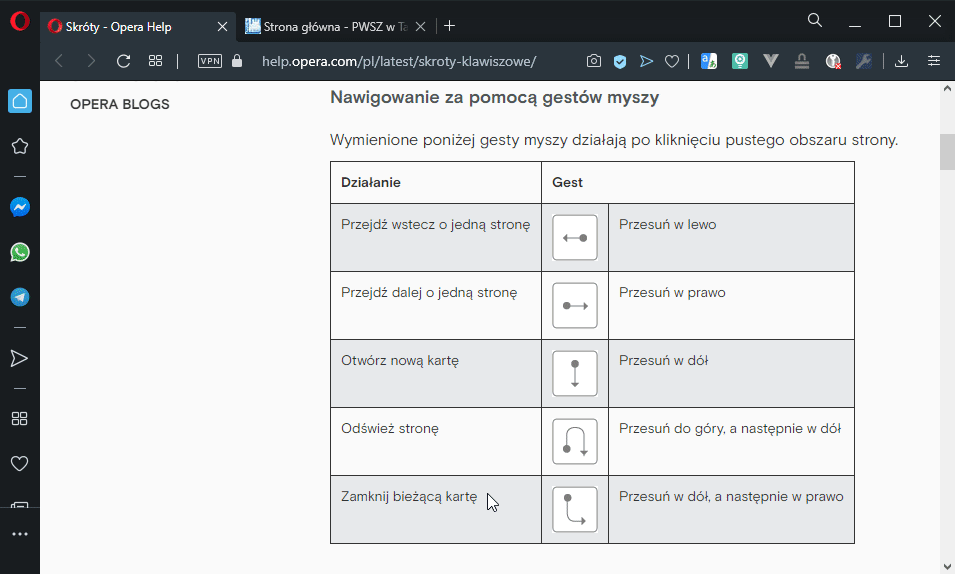
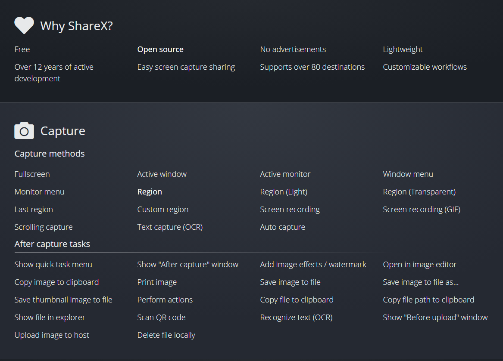
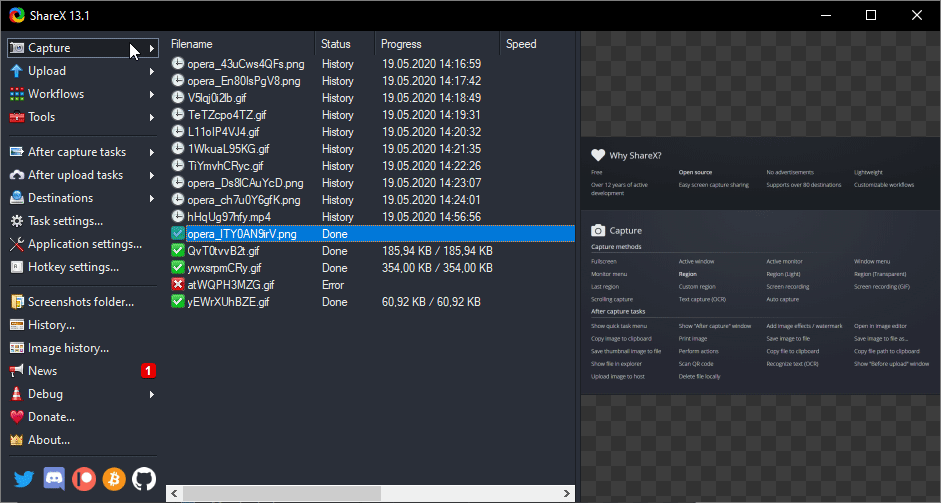
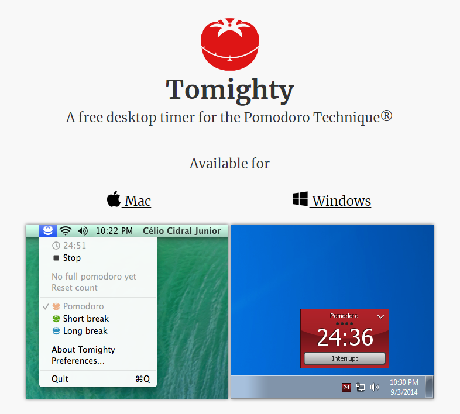

# Welcome everyone
Nowadays, in my opinion more important than used Operating System is Internet Browser choice. Tell me what browser You use, I tell You who you are :) 

> Priority of (window order at monitors) spended time in work
> 1. Browser
> 2. Editor
> 3. Communicator

## Programs & Tools list
| Category                      | Name    | Link                                                       | Platform              |
|-------------------------------|---------|------------------------------------------------------------|-----------------------|
| Browser                       | [Opera](#opera)   | https://www.opera.com/pl/download | Windows, Linux, macOS |
| Editor                        | VS Code | https://code.visualstudio.com                              | Windows, Linux, macOS |
| Mail                         | Thunderbird | https://www.thunderbird.net                              | Windows, Linux, macOS |
| Screen recorder / auto publish| [ShareX](#ShareX)   | https://getsharex.com/downloads                           | Windows               |

Are You interested in how to make instrictions like this? Check it [Markdown Cheatsheet](https://github.com/adam-p/markdown-here/wiki/Markdown-Cheatsheet)

## Screenshots

### Opera

###### Mouse Gestures (with Right Mouse Click) 
> https://addons.mozilla.org/pl/firefox/addon/opera-gestures/

###### Search in browser tabs

### ShareX 

###### Screen capture, file sharing and productivity tool

###### Possibilities menu

#### Tomighty 
###### Pomidorro method - nabieranie właściwych nawyków, umiejętność oderwania się od zadania jest pożądana

