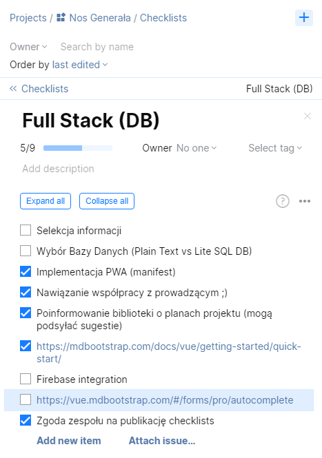
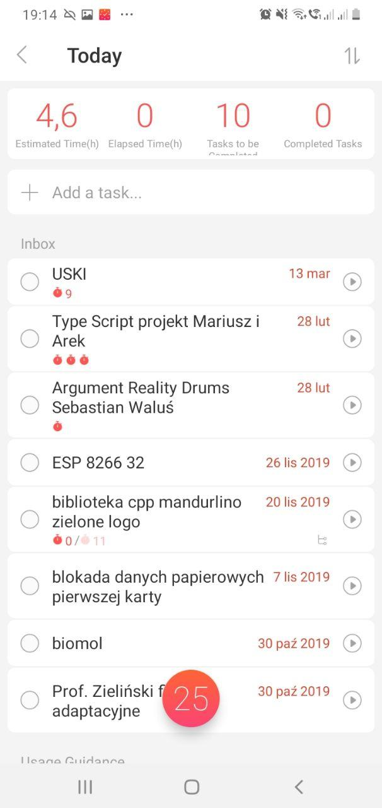

# Welcome everyone
Today, in my opinion, the Internet browser is much more important than the operating system you use. Tell me what browser you use, and I will tell you who you are :innocent:
> Priority of time spent at work (programs window order on monitors):
> 1. Browser
> 2. Editor
> 3. Communicator (Use less than) . ..

## Free programs list
| Category                       | Name                            | Link                            | Platform              |
| ------------------------------ | ------------------------------- | ------------------------------- | --------------------- |
| Editor                         | VS Code                         | https://code.visualstudio.com   | Windows, Linux, macOS |
| Mail client                    | Thunderbird (or system default) | https://www.thunderbird.net     | Windows, Linux, macOS |
| Screen recorder / auto publish | [ShareX](#ShareX)               | https://getsharex.com/downloads | Windows               |

More subiective list
----------------
- Multicommander
- Github Desktop
- ConEmu
- [Tomighty](https://tomighty.github.io)
- Creating Mind Palace 
  - Free
    - [diagrams.net](https://www.diagrams.net) (old draw.io, good integration with G Drive, diagrams looks very simple)      
    - [GitMind.com](https://gitmind.com/app) (online and fast)
  - Paid
    - [XMind](https://www.xmind.net) (Most intuitive)
    - **[Coggle](https://coggle.it)** (Well colored for learning by heart)  

Time planning
===============
###### Two ways of making Checklist (put mark on left or right side to writen task)
| Quality                                            | Quantity                                                                                                              |
| -------------------------------------------------- | --------------------------------------------------------------------------------------------------------------------- |
| - [x] Quality   - [x] Done   - [ ] Next task | (tomato represent estimation point)  Quantity :tomato::tomato::tomato::tomato: Other palan :tomato::tomato:  |
| **Examle in real world**                           |                                                                                                                       |
| Space                                              | Tomighty                                                                                                              |
|                     |                                                                                         |

The most frequent mistake: **Thinking, I don't need a rest**

Are you interested in how to make instructions like this? Check it [Markdown Cheatsheet](https://github.com/adam-p/markdown-here/wiki/Markdown-Cheatsheet)

*This README was made in one week before the lecture, what means a great success*
###  BONUS: How standard git repo should contains
* **docs** - *directory for images, and none executive data, like datasheet and presentation*
* **Readme.md** - *filename displayed by default, should contains image or gif from docs directory describing project*
### ToDo
- [ ] Eisenhower (Female) Time Planinng List  
- [ ] Warren Buffett (Male) Time Planinng List  

#### Developer communities [Produktywini](https://produktywni.pl) & [Zautomatyzowani](http://zautomatyzowani.pl)

## Screenshots

### Opera

>###### Mouse Gestures (with Right Mouse Click) 
>
> 
> [Firefox](https://addons.mozilla.org/pl/firefox/addon/opera-gestures)
> [Chrome](https://www.google.com/search?safe=active&client=opera&hs=sI7&sxsrf=ALeKk01YUHIbZmO3I4BPpMMtxpQm1mdmpQ%3A1590060053822&ei=FWTGXtaUMe70qwHU0peIDg&q=google+chrome+gestures&oq=Google+chrome+gest&gs_lcp=CgZwc3ktYWIQAxgAMgUIABDLATIFCAAQywEyBQgAEMsBMgUIABDLATIFCAAQywEyCQgAEBYQHhCLAzIJCAAQFhAeEIsDMgkIABAWEB4QiwMyCQgAEBYQHhCLAzIJCAAQFhAeEIsDOgQIIxAnOgYIIxAnEBM6BAgAEEM6CAgAEIMBEIsDOgoIABCDARBDEIsDOgcIABBDEIsDOgUIABCLAzoFCAAQgwE6AggAOgcIABAKEIsDOggIABDLARCLA1DkBVj0NGC6O2gBcAB4AIABtwGIAecRkgEEMC4xOZgBAKABAaoBB2d3cy13aXq4AQM&sclient=psy-ab)

###### Search in browser tabs

###### [Flow](https://help.opera.com/pl/touch/my-flow/)

###### Send pages to Opera Touch in your phone 

### ShareX 

###### Screen capture, file sharing and productivity tool

###### Lookup of possibilities

#### Tomighty 
###### Pomodoro method

