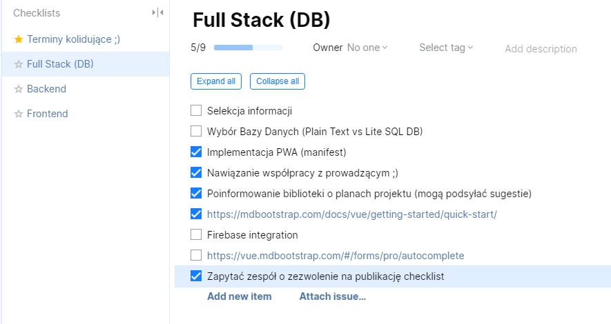

# Welcome everyone
Today, in my opinion, the Internet browser is much more important than the operating system you use. Tell me what browser you use, and I will tell you who you are 😉
> Priority of time spent at work (programs window order on monitors):
> 1. Editor
> 2. Browser
> 3. Communicator

## Programs & Tools list
| Category                       | Name    | Link                                                       | Platform              |
|--------------------------------|---------|------------------------------------------------------------|-----------------------|
| Browser                        | [Opera](#opera)   | https://www.opera.com/pl/download                | Windows, Linux, macOS |
| Editor                         | VS Code           | https://code.visualstudio.com                    | Windows, Linux, macOS |
| Mail client                    | Thunderbird       | https://www.thunderbird.net                      | Windows, Linux, macOS |
| Screen recorder / auto publish | [ShareX](#ShareX) | https://getsharex.com/downloads                  | Windows               |

More subiective list
----------------
- Multicommander
- Github Desktop
- ConEmu
- [Tomighty](https://tomighty.github.io)

Zarządzanie czasem
| Quality                       | Quantity    | 
|-------------------------|--|
| space| tomighty|
||

- [ ] ConEmu  
ConEmu * * * 

punkty estymacji

Najczęstszy błąd: założenie że nie potrzebujemy odpoczynku, zmęczenie materiału

Konspekty w Operze

Are you interested in how to make instructions like this? Check it [Markdown Cheatsheet](https://github.com/adam-p/markdown-here/wiki/Markdown-Cheatsheet)

## Screenshots

### Opera

>###### Mouse Gestures (with Right Mouse Click) 
>
> 
> [Firefox](https://addons.mozilla.org/pl/firefox/addon/opera-gestures)
> [Chrome](https://www.google.com/search?safe=active&client=opera&hs=sI7&sxsrf=ALeKk01YUHIbZmO3I4BPpMMtxpQm1mdmpQ%3A1590060053822&ei=FWTGXtaUMe70qwHU0peIDg&q=google+chrome+gestures&oq=Google+chrome+gest&gs_lcp=CgZwc3ktYWIQAxgAMgUIABDLATIFCAAQywEyBQgAEMsBMgUIABDLATIFCAAQywEyCQgAEBYQHhCLAzIJCAAQFhAeEIsDMgkIABAWEB4QiwMyCQgAEBYQHhCLAzIJCAAQFhAeEIsDOgQIIxAnOgYIIxAnEBM6BAgAEEM6CAgAEIMBEIsDOgoIABCDARBDEIsDOgcIABBDEIsDOgUIABCLAzoFCAAQgwE6AggAOgcIABAKEIsDOggIABDLARCLA1DkBVj0NGC6O2gBcAB4AIABtwGIAecRkgEEMC4xOZgBAKABAaoBB2d3cy13aXq4AQM&sclient=psy-ab)

###### Search in browser tabs

###### [Flow](https://help.opera.com/pl/touch/my-flow/)

###### Send pages to Opera Touch in your phone 

### ShareX 

###### Screen capture, file sharing and productivity tool

###### Lookup of possibilities

#### Tomighty 
###### Pomodoro method - nabieranie właściwych nawyków, umiejętność oderwania się od zadania jest pożądana u programistów

