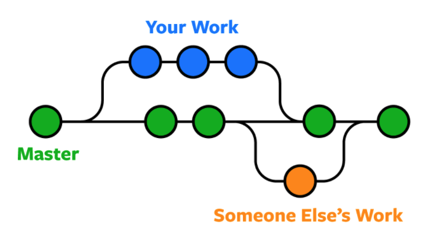

# Welcome everyone
Today, in my opinion, the Internet browser is much more important than the operating system you use. Tell me what browser you use, and I will tell you who you are :innocent:
> Priority of time spent at work (programs window order on monitors):
> 1. Browser
> 2. Editor
> 3. Communicator (Use less than) . ..

## Free programs list
| Category                       | Name                                                         | Link                                                            | Platform              |
| ------------------------------ | ------------------------------------------------------------ | --------------------------------------------------------------- | --------------------- |
| Editor                         | VS Code                                                      | https://code.visualstudio.com                                   | Windows, Linux, macOS |
| Mail client                    | Thunderbird (or system default)                              | https://www.thunderbird.net                                     | Windows, Linux, macOS |
| Screen recorder / auto publish | [ShareX](#ShareX) / [LightShot](https://app.prntscr.com/pl/) | https://getsharex.com/ https://app.prntscr.com/pl/download.html | Windows               |

More subiective list
----------------
- Multicommander (Win) / Commander One (Mac)
- Github Desktop
- ConEmu
- [Tomighty](https://tomighty.github.io) (Pomodoro method)
- Creating Mind Palace 
  - Free
    - [diagrams.net](https://www.diagrams.net) (old draw.io, good integration with G Drive, diagrams looks very simple)      
    - [GitMind.com](https://gitmind.com/app) (online and fast)
  - Paid
    - [XMind](https://www.xmind.net) (Most intuitive)
    - **[Coggle](https://coggle.it)** (Well colored for learning by heart)  

#### [Inżynier jakosci](https://inzynierjakosci.pl) Developer communities [Produktywini](https://produktywni.pl) & [Zautomatyzowani](http://zautomatyzowani.pl) 

Time planning
===============
###### Two ways of making Checklist (put mark on left or right side to writen task)
| Quality                                            | Quantity                                                                                                              |
| -------------------------------------------------- | --------------------------------------------------------------------------------------------------------------------- |
| - [x] Quality   - [x] Done   - [ ] Next task | (tomato represent estimation point)  Quantity :tomato::tomato::tomato::tomato: Other palan :tomato::tomato:  |
| **Examle in real world**                           |                                                                                                                       |
| Space                                              | Tomighty                                                                                                              |
|                     |                                                                                         |

The most frequent mistake: **Thinking, I don't need a rest**

Are you interested in how to make instructions like this? Check it [Markdown Cheatsheet](https://github.com/adam-p/markdown-here/wiki/Markdown-Cheatsheet)

*This README was made in one week before the lecture, what means a great success*
###  BONUS: What standard git repo should contains
* **docs** - *directory for images, and none executive data, like datasheet and presentation*
* **Readme.md** - *filename displayed by default, should contains image or gif from docs directory describing project*

## Setup before the meeting :wink:

- Install [git](https://git-scm.com/downloads) & [Github desktop](https://desktop.github.com)

- Install https://nodejs.org/en/download/ [How to](https://radixweb.com/blog/installing-npm-and-nodejs-on-windows-and-mac)

Przychodzimy z utworzonym kontem na Githubie.

Przyda się też konto do poczty na Gmailu do której masz dostęp.

###### Proszę o wpisywanie się na listę coogle.it (w biurze na laptopie prowadzącego)

## Intro

### Github Desktop

 + zaleta: można klonować repozytoria z różnch hostingów i mieć porządek, ta aplikacja to taki centralny punkt pośredniczący

## Agenda

### Teoria

1. Cel i do czego dążymy (następne zajęcia z Vue i indywidualne portfolio)

2. Co to git i github (rozproszony system kontroli wersji)

3. Po co mi to?
  - Gdy projekt jest tylko na jednej maszynie, wraz z jej awarią tracimy repozytorium, dlatego warto przechowaywać na zdalnym serwerze swój kod.
  - Rozgałęzienia pozwalają na zrównoleglanie pracy wielu programistów, a także na cofanie zmian.

### Synteza

1. Tworzenie repo

2. Tworzenie branchy

Dwa podejścia przy nazywaniu

__Imienne__ lub *master*, *dev* i __featureName__

3. *Portfolio na [githubie](https://github.com/topics/portfolio)?*

### Practice

1. Clone repository via Github Desktop https://github.com/informacja/EESTECtemplate
<!-- https://github.com/EESTEC-AGH-Krakow/eestec-website-home-frontend -->
2. Open project in Editor

  a) VS Code prese *Control + ~* to open terminal

3. Copy & run commands from Readme.md file

npm init vue@3

https://www.vuemastery.com/pdf/Vue-Essentials-Cheat-Sheet.pdf

## Na dokładkę 

featureImage with bug

dodaj gif

instal Vetur
create nuxt app
https://v3.nuxtjs.org/getting-started/quick-start/ // dla chętnych
https://v3.nuxtjs.org/examples/essentials/hello-world
https://www.vuemastery.com/pdf/Nuxtjs-Cheat-Sheet.pdf

>Przez GitHuba
>
>Tworzymy nowy projekt (na własny użytek - jednoosobowo)

wchodzimy na githuba, logujemy się

klikamy załóż nowe repo

wypełniamy + wyjaśniamy wszystkie pola

prezentacja jak wygląda nasze repo, markdown

Clonujemy projekt lokalnie

jako że cross-platformowo - będziemy korzystać z git_bash na 

windowsie a na macu normalnie lecimy z terminala 

jeśli ktoś z was nie korzystał nigdy z konsoli bashowej to

podsyłam wam małą ściągę

komenda clone -> pojawi się okno sign in

w przypadku pierwszego uzywania gita musimy:

skonfigurować emaila - git config --global user.email "you@example.com"

skonfigurować name - git config --global user.name "Your Name"

robimy dodajemy nowy plik

robimy pierwszy commit

robimy push

Przez git init
tworzymy katalog
robimy git init <directory>
tworzymy repo na githubie
git remote set-url origin https://github.com/USERNAME/REPOSITORY.git
jakąś zmianę wprowadzamy

Praca grupowa (jako contributor)

Przygotować zadania dla uczestników (issues)

Teoria 

branches

pull requests i jak dodać review

issues - gdzie

Praktyka

każdy clonuje sobie repo
przeglądamy kod
każdy dostaje taska
tworzymy brancha pod taska
edycja kodu - zaznaczone gdzie są zmiany - trzymać się swojego taska
dodajemy  plik
robimy commita

### ToDo
- [ ] Eisenhower (Proportion) Time Planinng List  
- [ ] Warren Buffett (Prioryty) Time Planinng List  
- [ ] _EGO_ as a special case of/look from diff perspective _ECO_
- [ ] OKR - quartal time Planinng

## Screenshots

### Opera

>###### Mouse Gestures (with Right Mouse Click) 
>
> 
> [Firefox](https://addons.mozilla.org/pl/firefox/addon/opera-gestures)
> [Chrome](https://www.google.com/search?safe=active&client=opera&hs=sI7&sxsrf=ALeKk01YUHIbZmO3I4BPpMMtxpQm1mdmpQ%3A1590060053822&ei=FWTGXtaUMe70qwHU0peIDg&q=google+chrome+gestures&oq=Google+chrome+gest&gs_lcp=CgZwc3ktYWIQAxgAMgUIABDLATIFCAAQywEyBQgAEMsBMgUIABDLATIFCAAQywEyCQgAEBYQHhCLAzIJCAAQFhAeEIsDMgkIABAWEB4QiwMyCQgAEBYQHhCLAzIJCAAQFhAeEIsDOgQIIxAnOgYIIxAnEBM6BAgAEEM6CAgAEIMBEIsDOgoIABCDARBDEIsDOgcIABBDEIsDOgUIABCLAzoFCAAQgwE6AggAOgcIABAKEIsDOggIABDLARCLA1DkBVj0NGC6O2gBcAB4AIABtwGIAecRkgEEMC4xOZgBAKABAaoBB2d3cy13aXq4AQM&sclient=psy-ab)

###### Search in browser tabs

###### [Flow](https://help.opera.com/pl/touch/my-flow/)

###### Send pages to Opera Touch in your phone 

### ShareX 

###### Screen capture, file sharing and productivity tool

###### Lookup of possibilities

#### Tomighty 
###### Pomodoro method
