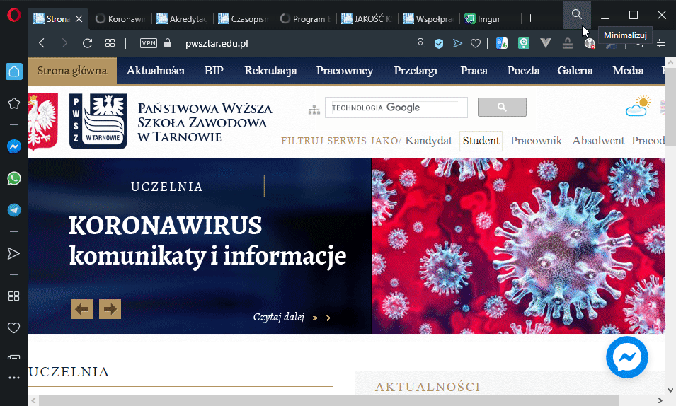

# Welcome everyone
Today, in my opinion, the Internet browser is much more important than the operating system you use. Tell me what browser you use, and I will tell you who you are :innocent:
> Priority of time spent at work (programs window order on monitors):
> 1. Browser
> 2. Editor
> 3. Communicator (Use less than) . ..

## Free programs list
| Category                       | Name                                                         | Link                                                            | Platform              |
| ------------------------------ | ------------------------------------------------------------ | --------------------------------------------------------------- | --------------------- |
| Editor                         | VS Code                                                      | https://code.visualstudio.com                                   | Windows, Linux, macOS, Web Browser |
| Web Browser                    | Arc                                                          | https://arc.net                                                 | Windows, macOS |

More subiective list
----------------
- Multicommander (Win) / Commander One (Mac)
- Github Desktop
- [Tomighty](https://tomighty.github.io) (Pomodoro method)
- Tools for creating Mind Palace 
  - Free
    - [diagrams.net](https://www.diagrams.net) (old draw.io, good integration with G Drive, diagrams looks very simple)
  - Paid
    - **[Coggle](https://coggle.it)** (Well colored for learning by heart)  

#### Developer growth training & community https://www.productivitybyheart.com/

Time planning
===============
###### Two ways of making Checklist (put mark on left or right side to writen task)
| Quality                                            | Quantity                                                                                                              |
| -------------------------------------------------- | --------------------------------------------------------------------------------------------------------------------- |

The most frequent mistake: **Thinking, I don't need a rest**

Are you interested in how to make instructions like this? Check it [Markdown Cheatsheet](https://github.com/adam-p/markdown-here/wiki/Markdown-Cheatsheet)

*This README was made in one day before the lecture, what means for me a great success*
###  BONUS: How standard git repo should contains
* **docs** - *directory for images, and none executive data, like datasheet and presentation*
* **Readme.md** - *filename displayed by default, should contains image or gif from docs directory describing project*

### ToDo
- [ ] Eisenhower (Proportion) Time Planinng List  
- [ ] Warren Buffett (Prioryty) Time Planinng List  
- [ ] _EGO_ as a special case of/look from diff perspective _ECO_
- [ ] OKR - quartal time Planinng

## Screenshots

### Arc Browser on smartphone

List of innovations
1. Browser tabs and bookmarks in one place (no more abstract objestcts)
2. Fullscreen mode on macOS
3. Boosts - edit web domain
4. Log in to browser to serch internet

### Opera pionierig parts

>###### Mouse Gestures (with Right Mouse Click) 
>
> 
> [Firefox](https://addons.mozilla.org/pl/firefox/addon/opera-gestures)
> [Chrome](https://www.google.com/search?safe=active&client=opera&hs=sI7&sxsrf=ALeKk01YUHIbZmO3I4BPpMMtxpQm1mdmpQ%3A1590060053822&ei=FWTGXtaUMe70qwHU0peIDg&q=google+chrome+gestures&oq=Google+chrome+gest&gs_lcp=CgZwc3ktYWIQAxgAMgUIABDLATIFCAAQywEyBQgAEMsBMgUIABDLATIFCAAQywEyCQgAEBYQHhCLAzIJCAAQFhAeEIsDMgkIABAWEB4QiwMyCQgAEBYQHhCLAzIJCAAQFhAeEIsDOgQIIxAnOgYIIxAnEBM6BAgAEEM6CAgAEIMBEIsDOgoIABCDARBDEIsDOgcIABBDEIsDOgUIABCLAzoFCAAQgwE6AggAOgcIABAKEIsDOggIABDLARCLA1DkBVj0NGC6O2gBcAB4AIABtwGIAecRkgEEMC4xOZgBAKABAaoBB2d3cy13aXq4AQM&sclient=psy-ab)

###### Search in browser tabs

###### [Flow](https://help.opera.com/pl/touch/my-flow/)

###### Send pages to Opera Touch in your phone 

#### Tomighty 
###### Pomodoro method

